# SpringLens-Reflection🪞

Reflection is one of those features that feels magical when you first
meet it, but behind the scenes it's just the JVM giving you a flashlight
and a set of tools to peek inside classes **at runtime**.

This repo is both code + guide. Run the code in while reading this file.
Each section here explains the *concepts, scenarios, and caveats*. Each
code package shows those ideas in action.

##  Why Reflection?

Imagine you're writing a framework.
You don't know which classes your users will write, what constructors
they'll provide, or which methods they'll expose. You only discover that
at **runtime**.

Reflection is the JVM's built-in "X-ray & remote control" that lets you:

-   **Inspect** any class that's been loaded (its fields, methods,
    constructors, annotations).
-   **Read & write** field values (even private ones).
-   **Call** methods by name and signature, even if you didn't code them
    directly.
-   **Instantiate** objects through chosen constructors.

Frameworks like **Spring**, **Hibernate**, **Jackson**, JUnit... all
lean on reflection heavily. That's how they can wire dependencies, map
JSON, auto-detect tests, or hook up HTTP routes without you doing `new`
everywhere.

↪️ In short: **Reflection trades compile-time certainty for runtime
flexibility.**

### When it shines

-   Dependency Injection containers (Spring).
-   Serialization / Deserialization (Jackson, Gson).
-   Plugin systems / dynamic module loading (lombok).
-   Testing frameworks (JUnit, Mockito).
-   Generic tools like ORMs, mappers, routers.

------------------------------------------------------------------------

## 1) Mental Model (How the JVM Sees Your Code)

1.  You compile `.java` → `.class`. These contain **metadata**: names,
    types, modifiers, annotations.
2.  A **ClassLoader** loads the bytes and creates a `Class<?>` object =
    the runtime "mirror" of your type.
3.  That `Class<?>` lets you explore **declared members** (fields,
    methods, constructors).
4.  From those handles, you can **invoke, set, get, or instantiate**.

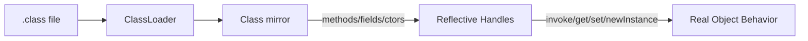

------------------------------------------------------------------------

## Methods → See, Invoke, Handle

**See code here:** [Reflect Methods ](https://github.com/hanin-mohamed/SpringLens-Reflection/tree/main/Reflection/src/main/java/com/springlens/reflection/a10_methods)

### Key ideas

-   `getDeclaredMethods()` → all methods declared in that class
    (including `private`).
-   `getMethods()` → only `public`, including inherited ones.
-   Look up specific methods with
    `getDeclaredMethod("name", ParamTypes...)`.

### Invocation

-   Instance → `method.invoke(instance, args...)`
-   Static → `method.invoke(null, args...)` 
-   Return is `Object` → cast if needed.

### Tips

-   Always match parameter types exactly (`int.class` vs `Integer.class`
    matters).
-   Exceptions are wrapped in `InvocationTargetException` → unwrap
    cause.

### ⚠️ Common Mistakes  

- **`NoSuchMethodException`**: Thrown when the method name or parameter signature does not match any method declared in the class.  
- **`IllegalAccessException`**: Raised when attempting to invoke a private method without first enabling accessibility using `setAccessible(true)`.  

------------------------------------------------------------------------

## Fields: List, Read, Write (static, private, generics, inheritance, final)

**See code here:** [Reflect Fields ](https://github.com/hanin-mohamed/SpringLens-Reflection/tree/main/Reflection/src/main/java/com/springlens/reflection/a20_fields)

### Discovering

-   `getDeclaredFields()` → every field declared on that class, any
    visibility.
-   `getFields()` → only `public`, including from superclasses.

### Reading & Writing

-   Instance field: `field.get(obj)` / `field.set(obj, value)`.
-   Static field: pass `null` instead of an instance.
-   Private field: call `setAccessible(true)` first.

### Generics

-   `getType()` → erasure type (e.g., `List`).
-   `getGenericType()` → shows `List<String>` or similar.
-   Cast to `ParameterizedType` to extract the actual arguments.

### Inheritance

-   Declared vs inherited matters:
    -   `getDeclaredFields()` on a child won't show parent's fields.
    -   `getFields()` will show public parent fields.

### Final fields

-   Don't rely on changing them: reflection may appear to "succeed" but
    the JVM can inline constants or ignore the write.
-   Safe assumption: final is **read-only**.

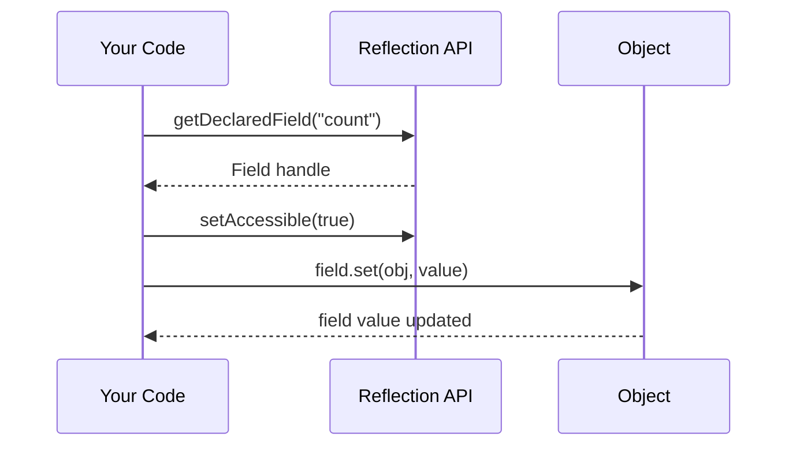

------------------------------------------------------------------------

## Constructors → Discover, Instantiate, Handle

**See code here:** [Reflect Constructors ](https://github.com/hanin-mohamed/SpringLens-Reflection/tree/main/Reflection/src/main/java/com/springlens/reflection/a30_constructors)

### Discovering

-   `getDeclaredConstructors()` → all cnstructors, any visibility.
-   `getConstructors()` → only public ones.

### Instantiation

-   Call `constructor.newInstance(args...)`.
-   Match argument types exactly.
-   For `private` constructors, use `setAccessible(true)`.

### Inheritance

-   Constructors are **not inherited**.
-   A child must declare its own constructors and call `super(...)`.

### ⚠️ Common Mistakes  

- **`NoSuchMethodException`**  
  Thrown when the requested constructor signature does not exactly match any declared constructor in the class.  

- **`IllegalAccessException`**  
  Occurs when attempting to call a non-public constructor without first enabling accessibility using `setAccessible(true)`.  

- **`InvocationTargetException`**  
  Wraps any exception that the constructor itself throws during object instantiation. The original cause can be retrieved using `getCause()`.  

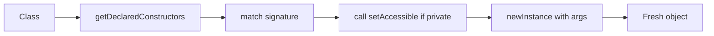

------------------------------------------------------------------------

##  Why Frameworks Love This

Put together: 
1. **Scan classes** at runtime. 
2. **Read metadata**
(annotations).
3. **Pick constructors** and build objects.
4. **Inject dependencies** into fields.
5. **Dispatch calls** by invoking methods dynamically.

That's how Spring wires `@Autowired` beans, how JUnit finds `@Test`
methods, and how Jackson maps JSON keys onto your object fields.

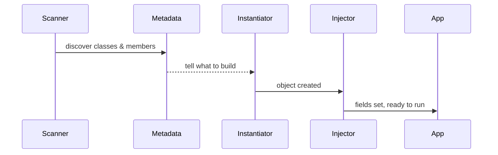

##  Annotations → Declare, Bind, Drive Behavior

Annotations are metadata attached to classes, methods, fields, or parameters.  
On their own, they are inert - but through **Reflection**, frameworks can **scan, detect, and act** on them at runtime.

Think of annotations as **labels** you place on your code. Reflection is the **scanner** that reads those labels and turns them into behavior.

---

### Retention and Visibility

Every annotation must declare how long it should live:  

- `RetentionPolicy.SOURCE` → discarded by the compiler (e.g., `@Override`).  
- `RetentionPolicy.CLASS` → kept in the `.class` file but not visible at runtime.  
- `RetentionPolicy.RUNTIME` → kept and visible via reflection.  

↪️ Frameworks like Spring require `RUNTIME` so they can inspect annotations dynamically.

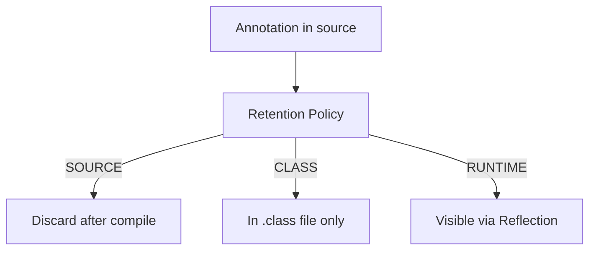

---

### Class Annotations — Declaring Roles

**General Idea**  
Class-level annotations mark the role or category of a class.

**See code here:** [Class Annotations Code Example](Reflection/src/main/java/com/springlens/reflection/a40_annotations/classannotations)

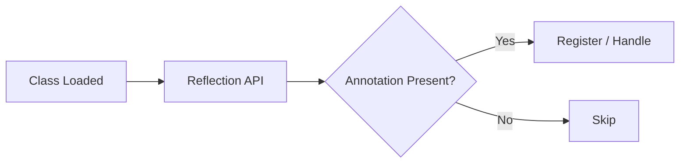

**In Spring**  
- `@Component`, `@Controller`, `@Service`, `@Repository`  
- During classpath scanning, Spring checks for these annotations with reflection.  
- If found, the class is registered as a bean in the ApplicationContext.

### ⚠️ Common Mistakes  

- **Missing `@Retention(RUNTIME)`**  
  If the retention policy is not set to `RUNTIME`, the annotation will not be available for reflection, making it invisible to frameworks at runtime.  

- **Misunderstanding `@Inherited`**  
  The `@Inherited` meta-annotation only applies to class-level annotations. It does not propagate to methods, fields, or parameters.  

---

### Method Annotations — Declaring Actions

**General Idea**  
Method-level annotations declare that a method has a special behavior.

**See code here:** [Method Annotations Code Example](Reflection/src/main/java/com/springlens/reflection/a40_annotations/methodannotations)

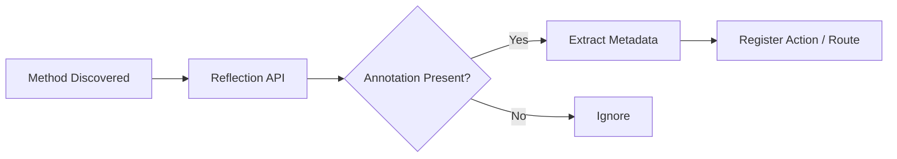

**In Spring MVC**  
- `@GetMapping`, `@PostMapping`, `@RequestMapping`  
- Spring scans controller methods, reads route info, and registers mappings.  
- On HTTP request, it locates the method and calls `method.invoke(controller, args...)`.

### ⚠️ Common Mistakes  

- **Duplicate mappings**  
  Defining two methods with the same route mapping creates ambiguity and leads to runtime conflicts.  

- **Overloaded methods**  
  Overloaded methods with the same name must be distinguished by exact parameter signatures; otherwise, reflection cannot resolve the correct method.  

- **Private methods**  
  Invoking private methods requires explicitly enabling accessibility with `setAccessible(true)`.  

---

### Field Annotations — Declaring Dependencies

**General Idea**  
Field-level annotations can signal that a dependency should be injected.

**Seecodehere:** [Field Annotations Code Example](Reflection/src/main/java/com/springlens/reflection/a40_annotations/injection)

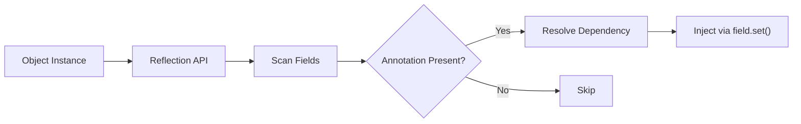

**In Spring**  
- `@Autowired`, `@Inject`  
- Spring detects annotated fields, resolves the bean type, and sets it via reflection.  

### ⚠️ Common Mistakes  

- **No matching bean**  
  If no bean of the required type exists in the application context, the framework raises a runtime injection exception.  

- **Multiple candidates without qualification**  
  When more than one bean matches the type, you must specify which one to inject using `@Qualifier`.  

- **Final fields**  
  Attempting to inject into `final` fields is unsafe and discouraged, as the assignment cannot be reliably completed.  

- **Static injection**  
  Injecting dependencies into static fields is strongly discouraged, as it breaks object-oriented design and leads to hard-to-test code.  

---

### Parameter Annotations — Declaring Bindings

Parameters can carry metadata to bind values.

**See code here:** [Parameter Annotations Code Example](Reflection/src/main/java/com/springlens/reflection/a40_annotations/params)

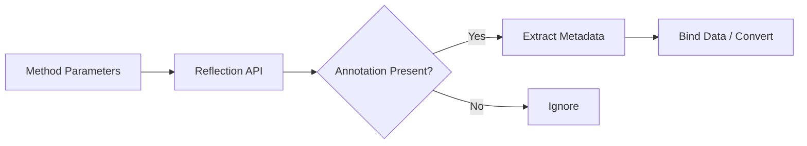

**In Spring MVC**  
- `@RequestParam`, `@PathVariable`  
- Spring inspects method parameters, extracts values from the request, converts them, and invokes the method.

### ⚠️ Common Mistakes  

- **Missing values**  
  If a required parameter is not provided in the request, the framework may inject `null` or throw an error depending on the configuration.  

- **Type conversion failures**  
  Occur when the provided input cannot be converted to the expected type (e.g., attempting to parse `"abc"` into a `Long`).  

- **Primitive type limitations**  
  Primitive types (`int`, `boolean`) cannot accept `null`. Use wrapper types (`Integer`, `Boolean`) when the parameter is optional.  

---

### Repeatable and Combined Annotations

**General Idea**  
Java supports repeatable annotations (`@Repeatable`).

**See code here:** [Repeatable Annotations Code Example](Reflection/src/main/java/com/springlens/reflection/a40_annotations/methodannotations/Role.java)

**In Spring**  
- Security annotations often stack (`@Secured`, `@RolesAllowed`).  
- Meta-annotations are common (`@RestController` combines `@Controller` + `@ResponseBody`).

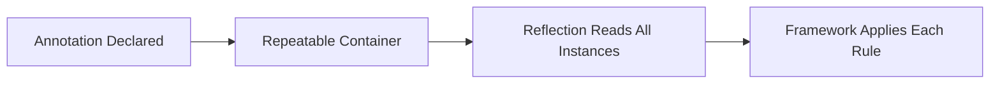

---

### Putting It All Together

Spring’s systematic annotation processing:

1. **Classpath scanning** → discover `@Component`, `@Controller`, etc.  
2. **Bean definition** → metadata recorded.  
3. **Dependency injection** → resolve and inject fields or constructors.  
4. **Routing** → register `@RequestMapping`, `@GetMapping` methods.  
5. **Parameter binding** → handle `@RequestParam`, `@PathVariable`.  
6. **Advanced behavior** → lifecycle (`@PostConstruct`), transactions (`@Transactional`), security (`@Secured`).

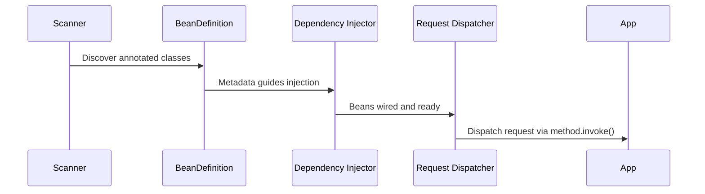

Reflection is the engine that turns annotations from labels into **runtime behavior**.

---

### Summary Table

| Annotation Target | Example (Spring)       | Reflection API                  |
|-------------------|------------------------|---------------------------------|
| Class             | `@Controller`          | `clazz.isAnnotationPresent(..)` |
| Method            | `@GetMapping`          | `method.getAnnotation(..)`      |
| Field             | `@Autowired`           | `field.getAnnotation(..)`       |
| Parameter         | `@RequestParam`        | `parameter.getAnnotations()`    |

---

